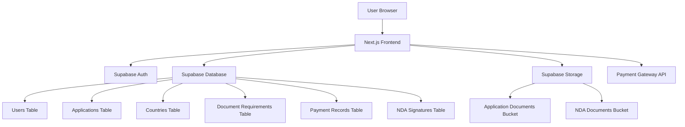

# Design Document

## Overview

The Afri-Rise Equity Limited Loan Application System is a Next.js web application that provides a comprehensive digital platform for companies across African countries to apply for financing. The system leverages Supabase as the backend-as-a-service platform, providing authentication, database, storage, and real-time capabilities.

The application follows a multi-step workflow: user registration with country selection, loan application form completion, document upload, payment processing, digital NDA signing, and real-time progress tracking. The system is designed to handle country-specific requirements and document variations across all African countries.

## Architecture

### Technology Stack

- **Frontend**: Next.js 14 with App Router
- **Backend**: Supabase (PostgreSQL database, Auth, Storage, Real-time)
- **Authentication**: Supabase Auth with email/password
- **File Storage**: Supabase Storage with organized folder structure
- **Payment Processing**: Pesapal integration for secure payment handling (with support for multiple payment gateways)
- **Digital Signatures**: Canvas-based signature capture with timestamp storage
- **Styling**: Tailwind CSS for responsive design
- **Deployment**: Vercel (recommended for Next.js applications)

### System Architecture



## Components and Interfaces

### Payment Gateway Architecture

The system implements a flexible payment gateway architecture that supports multiple payment providers:

```typescript
interface PaymentGateway {
  name: string;
  initializePayment(amount: number, currency: string, metadata: any): Promise<PaymentResponse>;
  verifyPayment(transactionId: string): Promise<PaymentStatus>;
  handleWebhook(payload: any, signature: string): Promise<WebhookResult>;
}

// Primary implementation for Pesapal
class PesapalGateway implements PaymentGateway {
  // Pesapal-specific implementation
}

// Extensible for other gateways
class StripeGateway implements PaymentGateway {
  // Stripe-specific implementation
}

class FlutterwaveGateway implements PaymentGateway {
  // Flutterwave-specific implementation
}
```

### Core Components

#### 1. Authentication System
- **Registration Component**: Multi-step form with country selection
- **Login Component**: Standard email/password authentication
- **Protected Route Wrapper**: HOC for route protection
- **Session Management**: Automatic token refresh via Supabase

#### 2. Application Management
- **Application Form Component**: Dynamic form based on provided application structure
- **Progress Tracker Component**: Visual progress indicator with step completion status
- **Country Selector Component**: Dropdown with all African countries
- **Form Validation**: Real-time validation with error messaging

#### 3. Document Management
- **Document Upload Component**: Drag-and-drop interface with file validation
- **Document Checklist Component**: Country-specific document requirements
- **File Preview Component**: PDF preview and download functionality
- **Document Organization**: Automatic ordering per requirements

#### 4. Payment Integration
- **Payment Form Component**: Multi-gateway payment interface (Pesapal primary, extensible for others)
- **Payment Gateway Abstraction**: Unified interface for different payment providers
- **Payment Status Component**: Real-time payment confirmation
- **Invoice Generation**: PDF invoice creation and storage
- **Payment History**: Transaction tracking and receipts

#### 5. Digital Signature
- **NDA Display Component**: Scrollable NDA document viewer
- **Signature Canvas Component**: Touch/mouse signature capture
- **Signature Verification**: Timestamp and user verification
- **Signature Storage**: Secure signature image storage

#### 6. Dashboard and Tracking
- **User Dashboard**: Application overview and status
- **Admin Dashboard**: Application management for staff
- **Real-time Updates**: Live status updates via Supabase Realtime
- **Notification System**: Email and in-app notifications

### API Interfaces

#### Supabase Database Schema

```sql
-- Users table (extends Supabase auth.users)
CREATE TABLE public.user_profiles (
  id UUID REFERENCES auth.users(id) PRIMARY KEY,
  country_id UUID REFERENCES countries(id),
  company_name TEXT NOT NULL,
  contact_person TEXT NOT NULL,
  official_address TEXT NOT NULL,
  phone TEXT NOT NULL,
  created_at TIMESTAMP WITH TIME ZONE DEFAULT NOW(),
  updated_at TIMESTAMP WITH TIME ZONE DEFAULT NOW()
);

-- Countries table
CREATE TABLE public.countries (
  id UUID DEFAULT gen_random_uuid() PRIMARY KEY,
  name TEXT NOT NULL UNIQUE,
  code TEXT NOT NULL UNIQUE,
  document_requirements JSONB NOT NULL,
  created_at TIMESTAMP WITH TIME ZONE DEFAULT NOW()
);

-- Applications table
CREATE TABLE public.applications (
  id UUID DEFAULT gen_random_uuid() PRIMARY KEY,
  user_id UUID REFERENCES auth.users(id),
  status TEXT DEFAULT 'draft' CHECK (status IN ('draft', 'submitted', 'under_review', 'approved', 'rejected')),
  application_data JSONB NOT NULL,
  created_at TIMESTAMP WITH TIME ZONE DEFAULT NOW(),
  updated_at TIMESTAMP WITH TIME ZONE DEFAULT NOW()
);

-- Document uploads table
CREATE TABLE public.document_uploads (
  id UUID DEFAULT gen_random_uuid() PRIMARY KEY,
  application_id UUID REFERENCES applications(id),
  document_type TEXT NOT NULL,
  file_path TEXT NOT NULL,
  file_name TEXT NOT NULL,
  file_size INTEGER NOT NULL,
  uploaded_at TIMESTAMP WITH TIME ZONE DEFAULT NOW()
);

-- Payment records table
CREATE TABLE public.payment_records (
  id UUID DEFAULT gen_random_uuid() PRIMARY KEY,
  application_id UUID REFERENCES applications(id),
  payment_gateway TEXT NOT NULL DEFAULT 'pesapal',
  gateway_transaction_id TEXT NOT NULL,
  gateway_reference TEXT,
  amount INTEGER NOT NULL,
  currency TEXT DEFAULT 'USD',
  status TEXT NOT NULL,
  paid_at TIMESTAMP WITH TIME ZONE,
  gateway_response JSONB,
  created_at TIMESTAMP WITH TIME ZONE DEFAULT NOW(),
  UNIQUE(payment_gateway, gateway_transaction_id)
);

-- NDA signatures table
CREATE TABLE public.nda_signatures (
  id UUID DEFAULT gen_random_uuid() PRIMARY KEY,
  application_id UUID REFERENCES applications(id),
  signature_data TEXT NOT NULL, -- Base64 encoded signature image
  signed_at TIMESTAMP WITH TIME ZONE DEFAULT NOW(),
  ip_address INET,
  user_agent TEXT
);
```

#### External API Integrations

**Payment Gateway APIs**
- **Pesapal API** (Primary): Payment request creation, status checking, webhook handling
- **Payment Gateway Abstraction Layer**: Unified interface supporting multiple providers
- **Extensible Architecture**: Easy integration of additional payment gateways (Stripe, PayPal, Flutterwave, etc.)
- Customer creation and management
- Invoice generation and management

**Email Service Integration**
- Supabase Auth email templates for notifications
- Custom email triggers for application status updates
- Payment confirmation emails
- Document upload confirmations

## Data Models

### User Profile Model
```typescript
interface UserProfile {
  id: string;
  country_id: string;
  company_name: string;
  contact_person: string;
  official_address: string;
  phone: string;
  email: string; // from auth.users
  created_at: string;
  updated_at: string;
}
```

### Application Model
```typescript
interface Application {
  id: string;
  user_id: string;
  status: 'draft' | 'submitted' | 'under_review' | 'approved' | 'rejected';
  application_data: {
    company_founded_year: number;
    company_offices: string;
    industry: string;
    employee_count: string;
    business_model: string;
    competitive_advantage: string;
    competitors: string;
    foreign_markets: boolean;
    previous_financing: boolean;
    financing_purpose: string;
    project_shovel_ready: boolean;
    financing_amount: number;
    requested_interest_rate: number;
    loan_term: number;
  };
  created_at: string;
  updated_at: string;
}
```

### Document Upload Model
```typescript
interface DocumentUpload {
  id: string;
  application_id: string;
  document_type: string;
  file_path: string;
  file_name: string;
  file_size: number;
  uploaded_at: string;
}
```

### Country Model
```typescript
interface Country {
  id: string;
  name: string;
  code: string;
  document_requirements: {
    required_documents: string[];
    company_documents: string[];
    director_documents: string[];
  };
  created_at: string;
}
```

## Error Handling

### Client-Side Error Handling
- Form validation with real-time feedback
- File upload error handling (size, type, network issues)
- Payment processing error display
- Network connectivity error handling
- Session expiration handling

### Server-Side Error Handling
- Database constraint violations
- File storage errors
- Payment processing failures
- Authentication errors
- Rate limiting and abuse prevention

### Error Logging and Monitoring
- Supabase error logging for database operations
- Client-side error tracking with error boundaries
- Payment error logging for audit trails
- File upload error tracking

## Testing Strategy

### Unit Testing
- Component testing with React Testing Library
- Utility function testing with Jest
- Form validation testing
- API integration testing with mocked responses

### Integration Testing
- End-to-end user flows with Playwright
- Payment processing integration tests
- File upload and storage tests
- Authentication flow testing

### Security Testing
- Input validation and sanitization
- File upload security (malicious file detection)
- Payment processing security
- Authentication and authorization testing
- SQL injection prevention testing

### Performance Testing
- File upload performance with large files
- Database query optimization
- Page load performance testing
- Mobile responsiveness testing

## Security Considerations

### Authentication and Authorization
- Supabase Row Level Security (RLS) policies
- JWT token validation and refresh
- Role-based access control for admin features
- Session management and timeout handling

### Data Protection
- Encryption at rest via Supabase
- HTTPS enforcement for all communications
- Sensitive data handling (payment information)
- GDPR compliance for user data

### File Security
- File type validation and sanitization
- Virus scanning for uploaded documents
- Secure file storage with access controls
- File size and quantity limits

### Payment Security
- PCI DSS compliance via payment gateway providers
- Secure payment token handling across multiple gateways
- Payment webhook signature verification for all providers
- Fraud detection and prevention
- Payment gateway abstraction for security consistency

## Deployment and Infrastructure

### Development Environment
- Local development with Supabase CLI
- Environment variable management
- Database migrations and seeding
- Local file storage simulation

### Production Environment
- Vercel deployment for Next.js application
- Supabase hosted database and services
- CDN for static assets and file delivery
- SSL certificate management

### Monitoring and Logging
- Application performance monitoring
- Error tracking and alerting
- Database performance monitoring
- File storage usage tracking
- Payment processing monitoring

### Backup and Recovery
- Automated database backups via Supabase
- File storage redundancy
- Application code version control
- Configuration backup and recovery procedures